# Allay Architecture Map

This document is the visual source of truth for Allay's current architecture. It maps the deployed system, backend modules, OTP processes, HTTP and WebSocket interfaces, background workers, persistence model, and frontend composition.

## System map

This is the primary at-a-glance view. Solid arrows represent calls or data flow; dotted arrows represent events or scheduled execution.

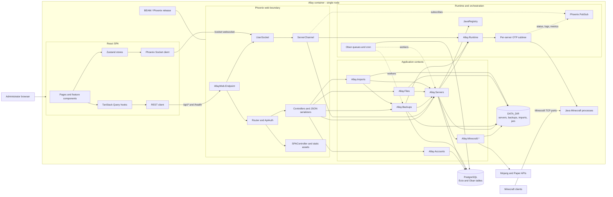

## Deployment topology

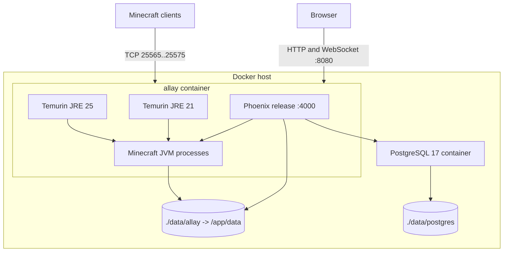

The current runtime registry, JVM ownership, logs, metrics, and filesystem are node-local. The supported topology is one Allay application node controlling the local Minecraft processes.

## OTP supervision tree

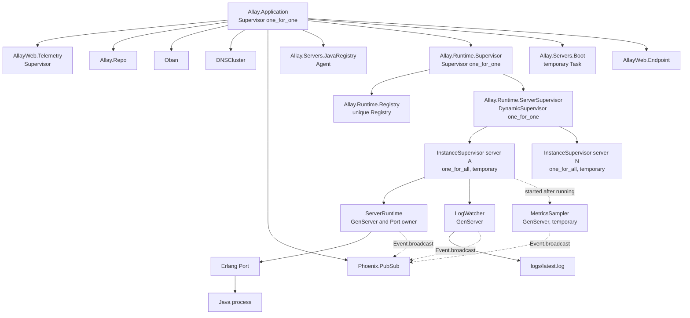

### Per-server runtime state machine

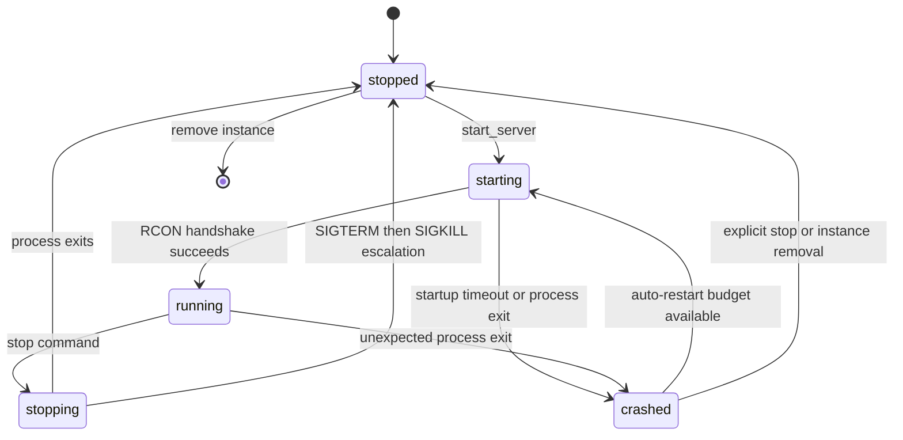

## Backend module map

The diagram uses UML-style dependency arrows. It intentionally groups implementation modules by responsibility while preserving every production module with domain behavior.

```mermaid
classDiagram
  namespace Infrastructure {
    class AllayApplication
    class AllayWebFacade
    class Endpoint
    class EndpointConfig
    class Telemetry
    class Release
    class Gettext
  }

  namespace Web {
    class Router
    class ApiAuth
    class AuthController
    class ServerController
    class ServerLifecycleController
    class ServerConfigController
    class ServerPropertiesController
    class ServerFileController
    class ServerIconController
    class BackupController
    class ImportController
    class SystemController
    class HealthController
    class SPAController
    class UserSocket
    class ServerChannel
    class ServerJSON
    class BackupJSON
    class ErrorJSON
    class FallbackController
    class ServerParams
  }

  namespace Contexts {
    class Accounts
    class Servers
    class Backups
    class Files
    class Imports
    class Runtime
  }

  namespace AccountModels {
    class Scope
  }

  namespace ServerServices {
    class Provisioner
    class JavaGate
    class JavaRegistry
    class RuntimeBridge
    class Boot
    class RestartTick
    class RestartWorker
  }

  namespace RuntimeProcesses {
    class RuntimeSupervisor
    class InstanceSupervisor
    class ServerRuntime
    class LogWatcher
    class MetricsSampler
    class Event
    class LogLine
    class RuntimeSpec
  }

  namespace BackupServices {
    class BackupWorker
    class SchedulerTick
  }

  namespace ImportServices {
    class Analyzer
    class Extractor
    class ImportSession
  }

  namespace FileServices {
    class PathSandbox
  }

  namespace MinecraftServices {
    class Versions
    class JarCache
    class JavaRuntime
    class Properties
    class Rcon
  }

  namespace Persistence {
    class Repo
    class User
    class UserToken
    class Server
    class Backup
    class BackupConfig
    class ObanJob
  }

  AllayApplication --> Telemetry
  AllayApplication --> Repo
  AllayApplication --> JavaRegistry
  AllayApplication --> RuntimeSupervisor
  AllayApplication --> Endpoint
  Endpoint --> EndpointConfig
  Endpoint --> Router
  Endpoint --> UserSocket
  AllayWebFacade --> Router
  AllayWebFacade --> UserSocket
  AllayWebFacade --> Gettext
  Release --> Repo

  Router --> ApiAuth
  Router --> AuthController
  Router --> ServerController
  Router --> ServerLifecycleController
  Router --> ServerConfigController
  Router --> ServerPropertiesController
  Router --> ServerFileController
  Router --> ServerIconController
  Router --> BackupController
  Router --> ImportController
  Router --> SystemController
  Router --> HealthController
  Router --> SPAController
  ApiAuth --> Accounts
  ApiAuth --> Scope

  UserSocket --> Accounts
  UserSocket --> ServerChannel
  ServerChannel --> Servers
  ServerChannel --> Runtime
  ServerChannel --> Event
  ServerChannel --> ServerJSON
  FallbackController --> ErrorJSON

  AuthController --> Accounts
  ServerController --> Servers
  ServerController --> Runtime
  ServerController --> ServerParams
  ServerLifecycleController --> Servers
  ServerConfigController --> Servers
  ServerConfigController --> ServerParams
  ServerPropertiesController --> Servers
  ServerFileController --> Files
  ServerIconController --> Servers
  BackupController --> Backups
  BackupController --> Servers
  ImportController --> Imports
  ImportController --> Analyzer
  ImportController --> ImportSession
  ImportController --> Runtime
  SystemController --> Versions
  SystemController --> JavaRegistry

  Accounts --> Repo
  Accounts --> User
  Accounts --> UserToken
  Servers --> Repo
  Servers --> Server
  Servers --> Provisioner
  Servers --> RuntimeBridge
  Servers --> Runtime
  Servers --> Backups
  Servers --> Versions
  Servers --> JarCache
  Servers --> Properties
  Backups --> Repo
  Backups --> Backup
  Backups --> BackupConfig
  Backups --> Runtime
  Backups --> Servers
  Files --> Servers
  Files --> PathSandbox
  Imports --> Servers
  Imports --> Backups
  Imports --> Analyzer
  Imports --> Extractor
  Imports --> ImportSession

  Provisioner --> JavaGate
  Provisioner --> Versions
  Provisioner --> JarCache
  Provisioner --> Properties
  Provisioner --> Repo
  JavaGate --> Versions
  JavaGate --> JavaRegistry
  JavaRegistry --> JavaRuntime
  RuntimeBridge --> JavaRegistry
  RuntimeBridge --> RuntimeSpec
  Boot --> JavaRegistry
  Boot --> Servers

  Runtime --> RuntimeSupervisor
  Runtime --> InstanceSupervisor
  InstanceSupervisor --> ServerRuntime
  InstanceSupervisor --> LogWatcher
  InstanceSupervisor --> MetricsSampler
  ServerRuntime --> RuntimeSpec
  ServerRuntime --> Rcon
  ServerRuntime --> Event
  LogWatcher --> LogLine
  LogWatcher --> Event
  MetricsSampler --> Event

  SchedulerTick --> BackupWorker
  SchedulerTick --> BackupConfig
  BackupWorker --> Backups
  BackupWorker --> Servers
  RestartTick --> RestartWorker
  RestartTick --> Server
  RestartWorker --> Servers
  RestartWorker --> Runtime
  BackupWorker --> ObanJob
  SchedulerTick --> ObanJob
  RestartTick --> ObanJob
  RestartWorker --> ObanJob
```

## HTTP and WebSocket interface

All routes under `/api/servers`, `/api/backups`, `/api/system`, and `/api/auth/me` pass through `ApiAuth`. Public routes are marked explicitly.

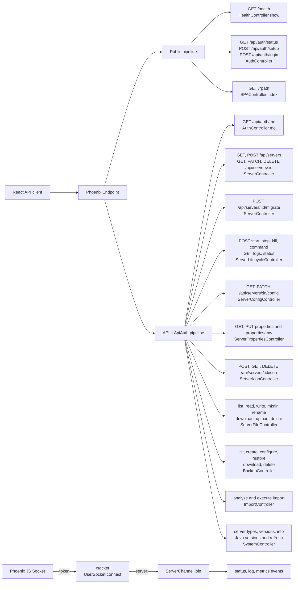

### Complete route catalog

| Authentication | Method | Path | Handler |
|---|---|---|---|
| Public | GET | `/health` | `HealthController.show` |
| Public | GET | `/api/auth/status` | `AuthController.status` |
| Public | POST | `/api/auth/setup` | `AuthController.setup` |
| Public | POST | `/api/auth/login` | `AuthController.login` |
| Required | GET | `/api/auth/me` | `AuthController.me` |
| Required | GET | `/api/servers` | `ServerController.index` |
| Required | POST | `/api/servers` | `ServerController.create` |
| Required | GET | `/api/servers/:id` | `ServerController.show` |
| Required | PATCH | `/api/servers/:id` | `ServerController.update` |
| Required | DELETE | `/api/servers/:id` | `ServerController.delete` |
| Required | POST | `/api/servers/:id/migrate` | `ServerController.migrate` |
| Required | GET | `/api/servers/:id/config` | `ServerConfigController.show` |
| Required | PATCH | `/api/servers/:id/config` | `ServerConfigController.update` |
| Required | GET | `/api/servers/:id/properties` | `ServerPropertiesController.show` |
| Required | PUT | `/api/servers/:id/properties` | `ServerPropertiesController.update` |
| Required | GET | `/api/servers/:id/properties/raw` | `ServerPropertiesController.show_raw` |
| Required | PUT | `/api/servers/:id/properties/raw` | `ServerPropertiesController.update_raw` |
| Required | POST | `/api/servers/:id/start` | `ServerLifecycleController.start` |
| Required | POST | `/api/servers/:id/stop` | `ServerLifecycleController.stop` |
| Required | POST | `/api/servers/:id/kill` | `ServerLifecycleController.kill` |
| Required | POST | `/api/servers/:id/command` | `ServerLifecycleController.command` |
| Required | GET | `/api/servers/:id/logs` | `ServerLifecycleController.logs` |
| Required | GET | `/api/servers/:id/status` | `ServerLifecycleController.status` |
| Required | POST | `/api/servers/:id/icon` | `ServerIconController.create` |
| Required | GET | `/api/servers/:id/icon` | `ServerIconController.show` |
| Required | DELETE | `/api/servers/:id/icon` | `ServerIconController.delete` |
| Required | POST | `/api/servers/:id/files/list` | `ServerFileController.list` |
| Required | GET | `/api/servers/:id/files/read/*path` | `ServerFileController.read` |
| Required | PUT | `/api/servers/:id/files/write/*path` | `ServerFileController.write` |
| Required | POST | `/api/servers/:id/files/mkdir/*path` | `ServerFileController.mkdir` |
| Required | POST | `/api/servers/:id/files/rename` | `ServerFileController.rename` |
| Required | GET | `/api/servers/:id/files/download/*path` | `ServerFileController.download` |
| Required | POST | `/api/servers/:id/files/upload` | `ServerFileController.upload` |
| Required | DELETE | `/api/servers/:id/files/*path` | `ServerFileController.delete` |
| Required | GET | `/api/backups/:serverId` | `BackupController.index` |
| Required | POST | `/api/backups/:serverId` | `BackupController.create` |
| Required | PATCH | `/api/backups/:serverId/config` | `BackupController.update_config` |
| Required | POST | `/api/backups/:server_id/import/analyze` | `ImportController.analyze` |
| Required | POST | `/api/backups/:server_id/import/:import_id/execute` | `ImportController.execute` |
| Required | POST | `/api/backups/:serverId/:backupId/restore` | `BackupController.restore` |
| Required | GET | `/api/backups/:serverId/:backupId/download` | `BackupController.download` |
| Required | DELETE | `/api/backups/:serverId/:backupId` | `BackupController.delete` |
| Required | GET | `/api/system/server-types` | `SystemController.server_types` |
| Required | GET | `/api/system/versions/:type` | `SystemController.versions` |
| Required | GET | `/api/system/info` | `SystemController.info` |
| Required | GET | `/api/system/java-versions` | `SystemController.java_versions` |
| Required | POST | `/api/system/java-versions/refresh` | `SystemController.refresh_java_versions` |
| Public | GET | `/*path` | `SPAController.index` |

WebSocket transport: `/socket/websocket`. Topic: `server:<server_id>`. Server-pushed events: `status`, `log`, and `metrics`.

## Worker and scheduling model

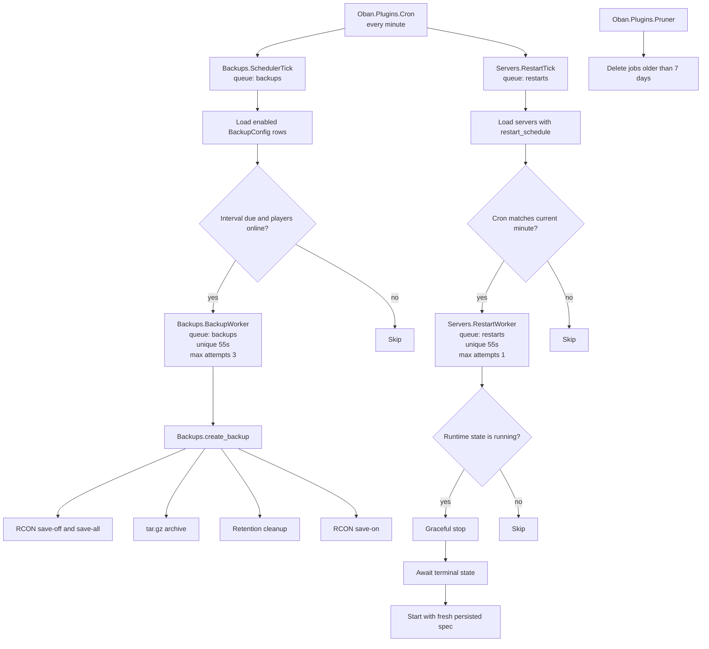

## Persistence model

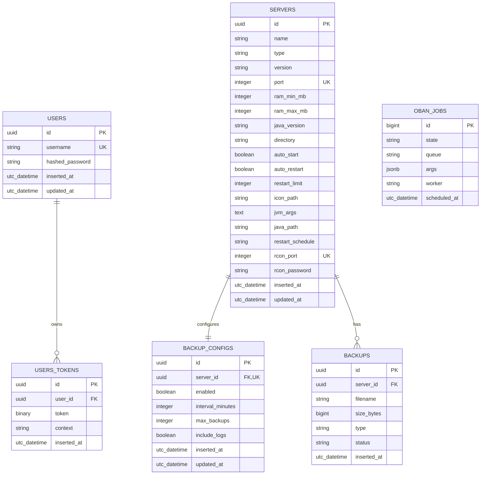

Oban jobs reference server IDs inside JSON arguments rather than through database foreign keys.

## Filesystem model

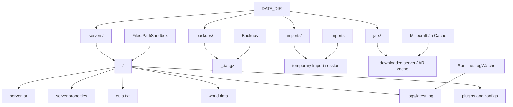

## Frontend module map

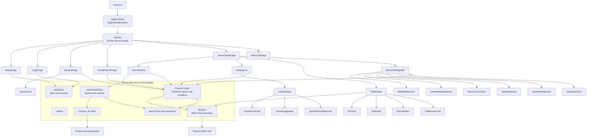

### Frontend hooks by backend capability

| Frontend hook/store | Capability | Backend boundary |
|---|---|---|
| `authStore` | Setup, login, session validation | `AuthController` |
| `useServers`, `useServer` | Server queries | `ServerController` |
| `useServerActions` | Create, start, stop, delete | `ServerController`, `ServerLifecycleController` |
| `useServerConfig` | Metadata, resources, automation, icons | `ServerConfigController`, `ServerIconController` |
| `useServerProperties` | Parsed properties | `ServerPropertiesController` |
| `useBackups` | Backup CRUD, restore, configuration | `BackupController` |
| `useImport` | Upload analysis and import execution | `ImportController` |
| `useMinecraftVersions` | Server versions | `SystemController` |
| `useJavaVersions` | Java discovery and refresh | `SystemController` |
| `useVersionMigration` | Type and version migration | `ServerController.migrate` |
| `useWebSocket`, `webSocketStore` | Logs, metrics, status | `UserSocket`, `ServerChannel` |

## Main end-to-end flows

### Start a server

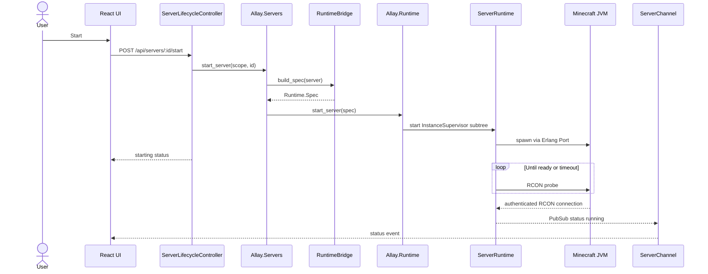

### Scheduled backup

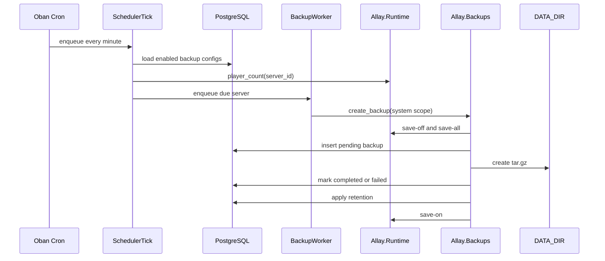

### Real-time console

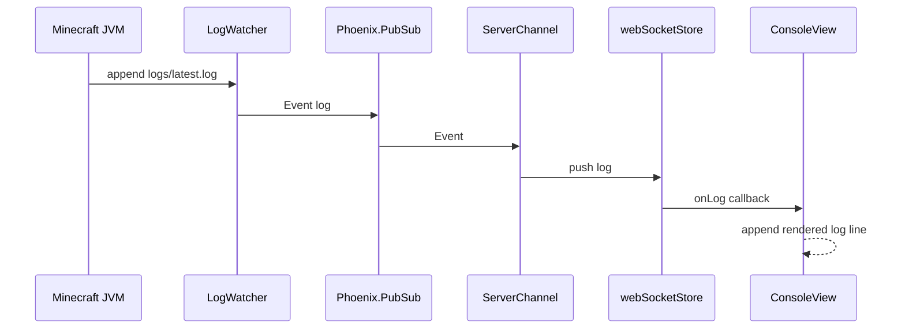

## Architectural ownership summary

| Concern | Owner |
|---|---|
| HTTP routing and authentication | `AllayWeb.Router`, `AllayWeb.Plugs.ApiAuth` |
| WebSocket authentication and authorization | `AllayWeb.UserSocket`, `AllayWeb.ServerChannel` |
| User accounts and API tokens | `Allay.Accounts` |
| Persisted server lifecycle and configuration | `Allay.Servers` |
| JVM process lifecycle and runtime state | `Allay.Runtime`, `Allay.Runtime.ServerRuntime` |
| Java installation discovery | `Allay.Servers.JavaRegistry` |
| Minecraft metadata and protocol helpers | `Allay.Minecraft.*` |
| Backup archive lifecycle | `Allay.Backups` |
| Scheduled work | Oban workers and cron plugins |
| Sandboxed server file access | `Allay.Files`, `Allay.Files.PathSandbox` |
| Import analysis and extraction | `Allay.Imports.*` |
| Relational persistence | `Allay.Repo`, Ecto schemas, PostgreSQL |
| Client server-state cache | TanStack Query |
| Client session and socket state | Zustand stores |
| Live status, logs, and metrics | Phoenix PubSub and Channels |
